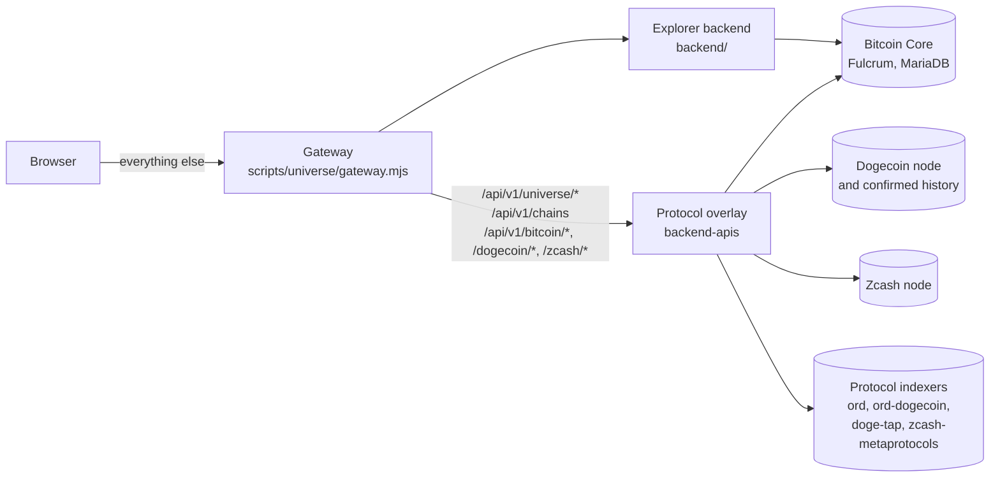

# Universe Explorer

A block and mempool explorer for Bitcoin, Dogecoin, and Zcash that also reads
the asset protocols carried on them, and states the evidence behind every claim
it makes.

Live at [explorer.bitcoinuniverse.io](https://explorer.bitcoinuniverse.io).


## What makes it different

Most explorers answer one of two questions. A mempool explorer tells you what is
pending and what it will cost to confirm. A protocol explorer tells you what
assets exist. Universe Explorer answers both, on three chains, and it never
guesses.

- **Exact asset flows.** A transaction page names the inputs and outputs that
  carry protocol assets, the action the authority reported, and the block that
  proves it. Nothing is inferred from transaction shape.
- **Outputs are first class.** `/outpoint/:txid/:vout` is a real page. An output
  is the unit that carries assets, so it gets its own address.
- **States that mean something.** Proven, partly proven, outside coverage,
  pending, and unavailable are five different answers. A missing indexer never
  becomes a false zero, and an authority that did not answer is never reported
  as one that answered nothing.
- **Every page says how current it is.** Chain pages carry a status rail with
  the same five readings in the same order: chain state, chain tip, blocks
  behind the tip, when the reading was taken, and how complete the pending set
  is. A figure that is true as of a block that is not the tip says so.
- **A verdict never travels without its evidence.** When a chain says it is not
  ready, the page says which part is missing, in English rather than in the
  API's codes: whose node did not answer, which indexer is behind, which index
  was built without a protocol switched on. A working authority that states the
  edges of its coverage is shown as exactly that, not as something broken. A
  chain that withholds readiness and gives no reason is reported as having
  given none.
- **Exact numbers, end to end.** Amounts cross the API as decimal strings and
  are shifted by string arithmetic, never parsed into a floating point number.
  Every rendered figure keeps the exact value it came from.
- **Live protocol activity, measured.** The pulse page publishes its own
  denominator: how many arriving transactions were checked, and how many carried
  each protocol. Every number on it can be reproduced.
- **No trackers, no accounts.** What you type is classified on your device.
  The searches that do need the server, completing a partly typed address and
  searching Dogecoin, Zcash or every chain at once, go to our own backend and
  to nobody else's. Saved pages and history stay in local storage.
- **First-party data only.** Every figure comes from Bitcoin Universe's own
  nodes, indexes, and protocol authorities.

## Three chains, and what each can answer

Chains are not interchangeable, and the interface does not pretend they are. The
chain selector switches the whole explorer, and each chain declares what it can
answer at `/api/v1/<chain>/status`. The overview page renders that declaration
rather than offering a page for a lookup the indexer never claimed.

| | Bitcoin | Dogecoin | Zcash |
| --- | --- | --- | --- |
| Transaction, block, address, outpoint | yes | yes | yes |
| Pending transactions | yes | yes | yes |
| Projected blocks | yes | no | no |
| Fee unit | sat/vB | per kilobyte | ZIP-317 logical actions |
| Protocol families | Ordinals, Rare Sats, Runes, and the rest of the registry | Doginals, DRC-20, Doge TAP | Zerdinals, ZRunes, ZRC-20 |

Three things follow from that table, and they are visible on the pages:

- Dogecoin fees are quoted per kilobyte. The explorer prints the unit the chain
  actually uses and shows a fee rate only when the first-party source reports
  one. Nothing is relabelled as sat/vB.
- Zcash fee guidance follows ZIP-317 logical actions where the node reports
  them, because a transaction's cost there is not a function of its byte size.
- Only the transparent side of Zcash is public. A Zcash transaction page reports
  the shape of the shielded side, how many Sprout joinsplits, Sapling spends and
  outputs, and Orchard actions it contains, and the one amount the chain itself
  makes public: the net movement between the transparent and shielded pools. It
  never infers a shielded sender, recipient, or amount.

Object identifiers do not carry between chains, so switching chains from an
object page lands on that chain's overview and says why, rather than looking up
a Bitcoin transaction id on Dogecoin.

![The Dogecoin overview page. The chain switcher in the header reads DOGE
Dogecoin, Ready. A status rail of five labelled readings gives Chain: Ready,
Chain tip: block 5,623,041, Behind tip: zero blocks, Last observed: 20 seconds
ago, Pending coverage: Complete. Below it a panel titled How much history is
readable now reads confirmed history complete, address history complete,
protocol history partial. A panel titled Questions this chain can answer marks
transaction, block, address and outpoint lookup and fee estimates as offered,
and projected blocks as not offered. A protocol indexers panel lists Doginals
and DRC-20 as ready with complete history, and TAP on Doge as degraded with
partial history, 184 blocks
behind.](docs/product/screenshots/dogecoin-overview.png)

Both screenshots are taken by the review harness in
`scripts/universe/visual-qa`, against fixed review data rather than the live
chain, so they show the interface exactly as it renders and no figure in them is
a claim about real chain activity.

## Protocol coverage

The registry carries every protocol in the Bitcoin Universe ecosystem, and the
explorer states plainly which ones it can actually read.

| State | Meaning |
| --- | --- |
| Live, read only | A first-party authority is running and its evidence is shown. |
| Not yet available | No first-party authority for it is configured or answering here. The explorer makes no claim about it. |

<!-- protocol-coverage:readable -->

6 of the 38 protocols in the registry are readable today:

- On bitcoin: **Ordinals**, **Rare Sats**, **Runes**, from ord.
- On zcash: **Zerdinals**, **ZRunes**, **ZRC-20**, from index-zcash-metaprotocols.

<!-- /protocol-coverage:readable -->

Readable is not the same as current, and the product never conflates them. An
authority that is rebuilding its index is still answering, and every page that
uses it states how far behind the chain tip it is rather than presenting its
answers as the present. `/api/v1/universe/sources` publishes the same figure,
and the production smoke check in
`.github/workflows/universe-production-smoke.yml` reads it on a schedule.

The roster itself is owned by `bitcoinuniverseio/backend-apis` and served by
`/api/v1/universe/protocols`. This repository pins a copy of it in
`docs/protocols/PROTOCOL-COVERAGE.json`, carrying the schema, the registry
version, the repository that produced it and the commit it was produced from,
and `docs/protocols/PROTOCOL-COVERAGE.md` is the readable table.
`node scripts/universe/protocol-contract.mjs --check` holds the pinned roster
and this repository's own surfaces together, and
`node scripts/universe/protocol-contract.mjs --against https://explorer.bitcoinuniverse.io`
fails when a deployment serves a roster that differs from the pin.

## Architecture

Three processes behind one HTTPS origin:

| Component | What it is |
| --- | --- |
| Explorer backend | `backend/` in this repository. Reads Bitcoin Core, Fulcrum, and MariaDB. |
| Protocol overlay | `backend-apis` standalone service. Serves `/api/v1/universe/*` and the chain-domain surfaces, and holds every indexer credential server side. |
| Frontend | `frontend/`, an Angular application served as static files with SPA fallback. |

`scripts/universe/gateway.mjs` is the single public entry point. It serves the
built frontend and splits `/api` between the two backends by path prefix.



Everything the browser can reach is on the left of the gateway. Every node,
index and credential is on the right of the overlay, and no indexer origin or
bearer token is ever exposed to a page. Lookalike paths such as
`/api/v1/chainstats` stay on the explorer backend. The route table is recorded
in `docs/operations/DEPLOYMENT.md` and held by
`node --test scripts/universe/gateway.test.mjs`.

`docs/architecture/` has the overlay design and `docs/data/ASSET-EVIDENCE.md`
the evidence contract.

## First-party data policy

No third-party blockchain API, public explorer, hosted indexer, analytics
service, or remote font is called at any point, from the server or the browser.
Collection-level artwork and metadata are the only permitted external sources,
and they are fetched server side and cached.

`node scripts/universe/check-origins.mjs` fails the build if a forbidden origin
appears in the source or in a production bundle. The production build also skips
asset synchronization, so nothing is downloaded from a third party at build time
either; mining pool logos fall back to the bundled default.

## Design system

One set of tokens in `frontend/src/styles/_universe-tokens.scss` carries colour,
type, space, motion, and layer for the whole product, in a light theme, a dark
theme, and a forced-contrast theme. Three rules hold it together, and each one
is measured rather than trusted:

- Pink is the brand and only the brand. Nothing pink ever means "it worked".
- Colour carries evidence state, never protocol identity on its own. A protocol
  hue always appears beside the protocol's name; an evidence state always
  carries its word, so neither depends on anyone noticing a hue.
- A fill and a label are different roles. Every strong fill declares the ink
  that goes on it, and `check-fills.mjs` fails the build if one does not.

`docs/product/DESIGN-SYSTEM.md` is the full account. The gates that hold it are
in the testing section below.

## Local development

Requires Node 24.19.0 and npm 11.17.0, both pinned in `.nvmrc` and
`package.json`.

```bash
cd backend && npm ci && npm run build && npm run start
```

```bash
cd frontend && npm ci && npm run serve
```

The frontend proxies `/api` to the backend. To point it at a running deployment
instead, set `MEMPOOL_BACKEND` in `frontend/proxy.conf.json`.

## Testing

```bash
cd frontend && npm run build:universe   # production build, no third-party fetches
cd frontend && npm run test             # Universe unit suite
cd frontend && npm run lint
cd backend && npm run test:ci && npm run lint
node scripts/universe/protocol-contract.mjs --check
node scripts/universe/check-text.mjs                 # no em dash anywhere
node scripts/universe/check-colors.mjs               # no raw interface colour
node scripts/universe/check-palettes.mjs             # measured contrast, both themes
node scripts/universe/check-fills.mjs                # every fill declares its ink
node scripts/universe/check-branding.mjs             # no obsolete upstream marks
node scripts/universe/check-origins.mjs              # no third-party data origins
node --test scripts/universe/gateway.test.mjs        # public route table
```

The visual matrix drives the built application across every route, theme,
viewport, and data state, and fails the run when a page never finishes loading,
when a chart panel draws nothing, or when a failure state says nothing about
why. Those three faults passed every other check in the list above and shipped
once, which is why the matrix exists.

```bash
cd frontend && npm run build:universe
UNIVERSE_GATEWAY_PORT=8099 UNIVERSE_GATEWAY_ROOT=frontend/dist/mempool/browser \
  node scripts/universe/gateway.mjs &
cd scripts/universe/visual-qa && npm ci
node capture.mjs --base=http://127.0.0.1:8099 --routes=dogecoin,dogecoin-tx
```

Run it with no `--routes` for the full matrix. Every API call is answered from
the fixtures in `fixtures.mjs` and `chain-fixtures.mjs`, so a difference between
two runs means the interface changed, not that the chain moved.

The same checks run in `.github/workflows/universe-ci.yml` on the self-hosted
runner fleet. The branding and origin gates also accept a built bundle path, and
the release workflow runs them against `frontend/dist` before anything ships.

## Configuration

The backend reads `backend/mempool-config.json`. The overlay reads
`UNIVERSE_EXPLORER_SOURCES_JSON`, a JSON array of authority descriptors whose
bearer tokens are named, never embedded:

```json
[{ "authorityId": "ord",
   "origin": "http://127.0.0.1:8382",
   "bearerTokenEnv": "UNIVERSE_ORD_TOKEN",
   "protocols": ["ordinals", "rare_sats", "runes"],
   "network": "bitcoin:mainnet" }]
```

Parsing is strict and all or nothing: one invalid descriptor disables the whole
registry rather than serving partially trusted data.

## Deployment

`docs/operations/DEPLOYMENT.md` documents the release procedure. Releases are
deployed beside the running one and the gateway upstream is flipped, so a
rollback is a single flip back. Every deployment publishes its own commit on
`/api/v1/backend-info` and on the public `/source` page.

## Source and licence

Universe Explorer is free software under the
[GNU Affero General Public License, version 3](LICENSE) or later. Section 13
requires that anyone interacting with it over a network can get the
corresponding source, which is what `/source` provides.

This repository is a fork of the upstream Mempool Open Source Project. Upstream
copyright notices and the full licence text in [COPYING.md](COPYING.md) are
preserved. Upstream trademarks are not used: see
`docs/legal/TRADEMARK-AUDIT.md` and `docs/legal/AGPL-COMPLIANCE.md`.

## Upstream relationship

[UPSTREAM.md](UPSTREAM.md) records the exact upstream base, every subsystem this
fork modifies, and the known conflict points. `docs/operations/UPSTREAM-SYNC.md`
is the synchronization procedure. Universe changes are deliberately isolated so
upstream security fixes stay easy to take.

## Security

Report a suspected vulnerability through GitHub's private vulnerability
reporting for this repository:
[open a report](https://github.com/bitcoinuniverseio/mempool/security/advisories/new).
It stays private to the maintainers. Do not put one in a pull request, which is
public the moment it is written. [SECURITY.md](SECURITY.md) has what to include
and what is in scope, and `docs/security/THREAT-MODEL.md` records the trust
boundaries this deployment assumes.

## Contributing

Work happens on `develop`. Open a pull request against it, keep Universe changes
inside `frontend/src/app/universe/` and the documented integration points where
possible, and make sure the checks above pass.

This repository has its issue tracker turned off, so a pull request is how
anything gets raised, discussed, and recorded. Open one even for a report you
cannot fix yourself: describe what you saw and where, and leave the diff empty
if you have nothing to change yet. [CONTRIBUTING.md](CONTRIBUTING.md) has the
rest.
