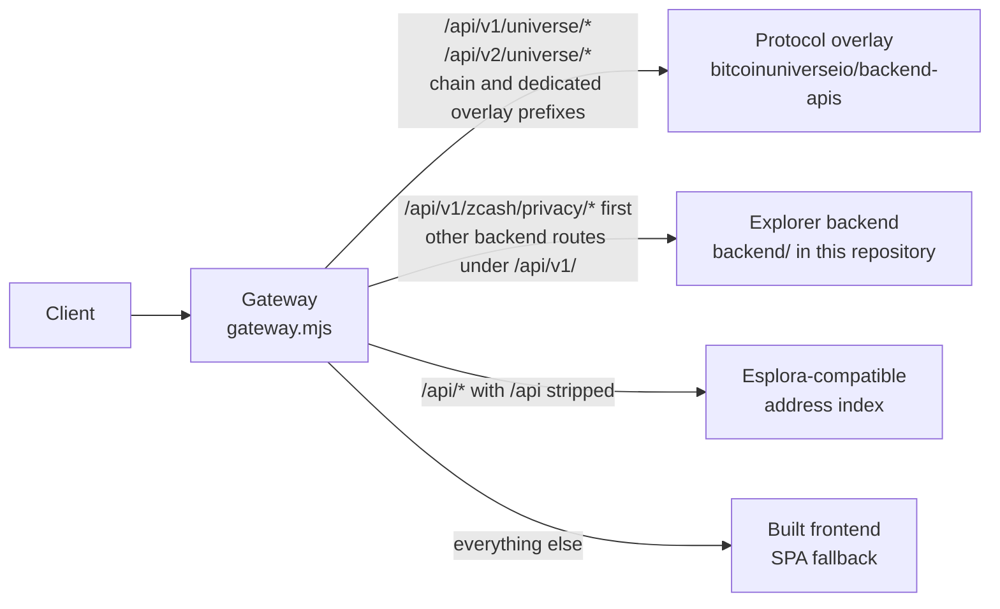

# Public HTTP surface

Everything a browser or a client can reach on a Universe Explorer origin, and
which process actually answers it.

This is a routing and integration reference, not a field-by-field schema. The
per-field documentation for the inherited Bitcoin REST API is served by the
application itself at `/docs/api/rest`, generated from
`frontend/src/app/docs/api-docs/api-docs-data.ts`.

Authentication and side effects depend on the handler. Public explorer reads,
local inspectors, portfolio persistence, sharing, and privileged admin adapters
have different contracts. This reference does not grant mutation or admin access.
`POST /api/v1/tx/push` is always mounted, and `POST /api/v1/tx` is mounted when
the backend serves the transaction family itself. Both hand raw bytes to
Bitcoin Core and store nothing.

## Three processes, one origin

`scripts/universe/gateway.mjs` is the single public entry point. It serves the
built frontend and splits `/api` between the backends by path prefix. The rule
is in `routeFor()` in that file and is held by
`node --test scripts/universe/gateway.test.mjs`.



| Path | Answered by | Notes |
| --- | --- | --- |
| `/api/v1/universe/**` | protocol overlay | Universe protocol domain |
| `/api/v2/universe/**` | protocol overlay | Portfolio v2; forwarding does not prove every offered handler exists |
| `/api/v1/chains` | protocol overlay | the chain roster |
| `/api/v1/zcash/privacy` and its children | explorer backend | checked before the generic Zcash prefix; lookalike names do not match |
| `/api/v1/bitcoin/**`, `/api/v1/dogecoin/**`, `/api/v1/zcash/**` | protocol overlay | per-chain domain surfaces |
| `/api/v1/anima/**` | protocol overlay | status, transition events, items and item history |
| everything else under `/api/v1/**` | explorer backend | the inherited Bitcoin API, plus the Universe capability report |
| `/api/internal/**` | nobody | refused with `404` at the gateway when an index is configured, so index administration never reaches the public origin |
| `/api/**` | the address index, with `/api` stripped | only when the deployment runs one; otherwise it is rewritten onto the backend's `/api/v1/` prefix |
| everything else | the built frontend | SPA fallback to `index.html` |

Two consequences are worth stating plainly because both have caused confusion:

- **Lookalike paths stay with the backend.** `/api/v1/chainstats` is not
  `/api/v1/chains`, and the prefix match is on a full segment. Anything under
  `/api/v1/` that does not match a dedicated overlay prefix is the backend's.
- **With `MEMPOOL.BACKEND` set to `esplora` the backend does not mount the
  address, script hash, transaction, block, or mempool routes at all.** It
  expects the edge to send that whole family to the index. Point `/api/` at the
  backend in that mode and every one of those paths answers `404` while the site
  still loads.

## Universe endpoints

These endpoints exist in this fork or its Universe overlay. The examples below
include historical observations from 2026-09-01 and are not current acceptance.
The current operation ledger is in `docs/acceptance/`; a registry size or an
HTTP success alone is not a full application coverage claim.

### Selected chain and network

Existing Universe asset, flow, holdings, outpoint, source, activity and objects
routes accept `?chain=bitcoin&network=signet`. ANIMA reads use the same query
contract. Both fields are required when either is supplied; omitting both
intentionally retains Bitcoin mainnet. Invalid combinations return `400`.
The legacy registry-only `?chain=...` filter remains supported.

Protocol detail reads use the chain declared by the registry. Bitcoin follows
the selected route network; the other-chain directory paths currently request
their offered mainnet context. Switching Bitcoin to Signet does not select
Signet for Dogecoin, Zcash or Fractal. Cached registry responses and nested
source/transaction evidence are checked against the requested context.

The authority identity is `(authorityId, chain, network)`. A missing Signet
source reports unconfigured; it never borrows the mainnet source. Requests,
checkpoint caches, enrichment caches and saved links preserve the selected
context. A checkpoint whose context differs from the request is rejected by
the frontend. A missing checkpoint does not establish block-level proof.

| Read | Method and route |
| --- | --- |
| Inscription / rune / sat | `GET /api/v1/universe/{inscriptions,runes,sats}/:reference` |
| Block inscriptions | `GET /api/v1/universe/blocks/:height/inscriptions?page=0` |
| Transaction flow | `GET /api/v1/universe/transactions/:txid` |
| Transaction batch | `POST /api/v1/universe/transactions/batch`, body `{ "txids": [...] }`, maximum 25 |
| Address holdings | `GET /api/v1/universe/addresses/:address/holdings?limit=100&offset=0` |
| Outpoint | `GET /api/v1/universe/outpoints/:txid/:vout` |
| Outpoint batch | `POST /api/v1/universe/outpoints/batch`, body `{ "outpoints": [...] }`, maximum 50 |
| Protocol activity / objects | `GET /api/v1/universe/protocols/:protocolId/{activity,objects}?limit=25&cursor=...` |

Append context with `&chain=bitcoin&network=signet` when a route already has
query parameters. Batch POSTs are reads, not broadcasts. Invalid entries retain
their own result row. Registry aliases resolve through the owned registry.

The OP inscriptions objects adapter reads its authority's existing
`/api/op-inscriptions/inscriptions` endpoint and validates its offset pagination.
An objects page is not an activity feed or proof of a mint/transfer operation.

### `GET /api/v1/capabilities`

Explorer backend, added by this fork in `backend/src/api/capabilities.routes.ts`.

What this deployment can actually serve. The frontend reads it so it never
advertises a page whose backend routes were never mounted, and the release
preflight reads it to refuse an incoherent cutover.

```json
{
  "schemaVersion": "universe-explorer-capabilities-v1",
  "releaseSha": "2d88cef",
  "network": "mainnet",
  "generatedAt": "2026-09-01T11:34:12.938Z",
  "features": {
    "statistics": {
      "enabled": true,
      "routesRegistered": true,
      "dependencies": [
        { "name": "database", "configured": true, "reachable": true, "detail": null }
      ],
      "state": "ready",
      "coverage": { "from": "2026-08-28T10:23:00.000Z", "to": "2026-09-01T11:34:05.000Z" },
      "rowCount": 6491,
      "lastSuccessfulUpdate": "2026-09-01T11:34:05.000Z",
      "lagSeconds": 8,
      "degradedReason": null
    }
  }
}
```

`state` is one of `ready`, `syncing`, `degraded`, `unavailable`, `disabled`.
`syncing` exists on purpose: a dependency that is present, correct, and simply
not finished yet is not the same as one that is broken. `enabled` means the
feature is switched on in configuration; `routesRegistered` means its HTTP
routes were actually mounted. The two can disagree, and that disagreement is
the fault the report exists to make visible.

Nothing in the report names a secret, a private origin, or a credential. The
type definitions are in `backend/src/api/capabilities.ts`.

### `GET /api/v1/backend-info`

Explorer backend. Upstream endpoint, extended by this fork with `chainSync` so
the explorer can say when its own data is behind the chain.

The response also carries `hostname` and `osVersion`, which describe the host
the backend runs on. They are omitted from the example below rather than
written into this repository.

```json
{
  "version": "3.3.1",
  "gitCommit": "2d88cef",
  "lightning": false,
  "backend": "electrum",
  "coreVersion": "/Satoshi:31.0.0/",
  "chainSync": {
    "blocks": 965030,
    "headers": 965030,
    "initialBlockDownload": false,
    "verificationProgress": 1,
    "checkedAt": "2026-09-01T11:32:51.722Z"
  }
}
```

`gitCommit` is the commit the backend was built from. The frontend publishes
its own in `/resources/config.js` as `GIT_COMMIT_HASH`. A release expects the
two to match, and `scripts/universe/release-manifest.mjs verify` holds a live
origin to that.

### `GET /api/v1/chains`

Protocol overlay. The chain roster, one capability document per chain and
network, each declaring `schemaVersion: "universe-chain-capability-v1"`.

Each document carries the chain and network, the asset's symbol, precision, and
atomic unit, a `tip`, a `sync` block, a `mempool` block, a `reads` map of which
lookups that chain offers, and a `protocols` array with each protocol's state,
coverage, and lag in blocks. Amounts and heights cross this API as decimal
strings, never as JSON numbers, so no exact value is lost to a float.

`reads` is what the overview page renders. Reading it rather than assuming is
the point: on 2026-09-01 the live roster offered `projectedBlocks` on Bitcoin
and not on Dogecoin or Zcash, and `candidateBuckets` on Dogecoin and Zcash and
not on Bitcoin.

### `GET /api/v1/<chain>/status`

Protocol overlay, for `bitcoin`, `dogecoin`, and `zcash`. The same capability
document as the matching entry in `/api/v1/chains`, for one chain. An
unrecognized `network` query value is rejected rather than answered.

### `GET /api/v1/universe/protocols`

Protocol overlay. The protocol roster: every protocol in the registry with its
id, display name, family, chain, networks, release status, indexer authority,
and coverage. Registry 1.1.0 retains 39 identities, including ANIMA, and adds
`readOperationDescriptors` plus populated `implementedReadOperations` and
`authorizedReadOperations`. Descriptors name implemented handlers and source
contracts; their `NOT TESTED` acceptance value and historical release flags
must not be interpreted as a current E2E pass. Deployment configuration is
reported separately by source/status reads.

The roster is owned by `bitcoinuniverseio/backend-apis`. This repository pins a
copy in `docs/protocols/PROTOCOL-COVERAGE.json` and renders it as a table in
`docs/protocols/PROTOCOL-COVERAGE.md`.
`node scripts/universe/protocol-contract.mjs --check` holds the pin and this
repository's surfaces together, and
`node scripts/universe/protocol-contract.mjs --against <origin>` fails when a
deployment serves a roster that differs from the pin.

### `GET /api/v1/universe/sources`

Protocol overlay. One row per indexer authority: which protocols it answers
for, whether it is `ready`, its checkpoint height and block hash, its status,
lag in blocks, when it last answered, when it last succeeded, and its
consecutive failure count. Statuses observed on the live origin include
`ready`, `stale`, `degraded`, and `unconfigured`, and `unconfigured` is the one
that matters most: it says no authority for that protocol is wired up here, not
that the protocol has nothing in it.

This is the endpoint that makes "the explorer never guesses" checkable. An
authority that is rebuilding is still answering, and its lag is published
rather than hidden behind a figure presented as current.

No origin, port, path, or bearer token for any authority appears in the
response. The overlay holds all of those server side.

### `GET /api/v1/universe/status`

Protocol overlay. The deployment's own release identity, used by the `/source`
page to satisfy AGPL section 13. See `docs/legal/AGPL-COMPLIANCE.md`.

## The inherited Bitcoin API

Browser GET requests accepting `text/html` for `/api`, `/api/faq`, and
`/api/api/:type` reach the inherited Angular documentation routes. Other API
requests retain the dispatch rules below, including versioned API requests
that accept HTML.

The explorer backend serves the upstream Mempool REST API under `/api/v1/`.
The route table is registered in
`backend/src/api/bitcoin/bitcoin.routes.ts`. The families, with the paths as
they are registered:

| Family | Representative paths |
| --- | --- |
| Fees | `fees/recommended`, `fees/precise`, `fees/mempool-blocks` |
| Mempool | `mempool`, `mempool/txids`, `mempool/recent` |
| Transactions | `tx/:txId`, `tx/:txId/hex`, `tx/:txId/status`, `tx/:txId/outspends`, `tx/:txId/merkle-proof`, `tx/:txId/rbf`, `cpfp/:txId` |
| Blocks | `blocks`, `blocks/:height`, `block/:hash`, `block/:hash/txids`, `block/:hash/txs`, `block/:hash/summary`, `blocks/tip/height`, `blocks/tip/hash`, `block-height/:height` |
| Addresses | `address/:address`, `address/:address/txs`, `address/:address/utxo`, `address/:address/txs/summary` |
| Script hashes | `scripthash/:scripthash` and the same three sub-paths |
| Chain | `difficulty-adjustment`, `chain-tips`, `stale-tips` |
| Mining | `mining/pools/:interval`, `mining/pool/:slug`, `mining/hashrate/:interval`, `mining/reward-stats/:blockCount`, `mining/blocks/fees/:interval`, and the rest of the mining family in `backend/src/api/mining/mining-routes.ts` |
| Statistics | `statistics/2h`, `statistics/24h`, `statistics/1w`, `statistics/1m`, `statistics/3m`, `statistics/6m`, `statistics/1y`, `statistics/2y`, `statistics/3y`, `statistics/4y`, `statistics/all` (fixed intervals, not a parameter) |
| Broadcast | `tx/push`, and `tx` when the transaction family is served here |
| Validation | `validate-address/:address` |

The address and script hash families are the ones the `MEMPOOL.BACKEND` split
moves. Read `/api/v1/capabilities` to learn which infrastructure is answering
them on a given deployment, rather than inferring it from a `404`.

WebSocket upgrades on `/api/v1/**` go to the explorer backend, except
`/api/v1/universe/ws`, which goes to the overlay.

## Response headers

The gateway applies the same security headers to every response, from
`SECURITY_HEADERS` in `scripts/universe/gateway.mjs`:

```
x-content-type-options: nosniff
x-frame-options: DENY
referrer-policy: no-referrer
cross-origin-opener-policy: same-origin
permissions-policy: accelerometer=(), camera=(), display-capture=(), geolocation=(), gyroscope=(), magnetometer=(), microphone=(), payment=(), usb=()
strict-transport-security: max-age=31536000; includeSubDomains
```

`referrer-policy: no-referrer` is the one that matters most for a reader: a
page URL on this site contains an address, a transaction, or an output, and
leaking it to any site a visitor clicks through to would undo the rest of the
privacy work.

Documents additionally carry a content security policy computed per request
from the document being served. Everything the page loads comes from the same
origin; `connect-src` is `'self'`, so a page cannot reach a third-party data
source even if one were added to the source by mistake.

## Working against a live origin

```bash
ORIGIN=https://explorer.bitcoinuniverse.io

# Which chains are served, and what each offers
curl -s "$ORIGIN/api/v1/chains" | jq -r '.[] | "\(.chain):\(.network) ready=\(.ready)"'

# Which features this deployment actually mounted
curl -s "$ORIGIN/api/v1/capabilities" | jq '.features | map_values(.state)'

# Which indexer authorities are behind, and by how much
curl -s "$ORIGIN/api/v1/universe/sources" \
  | jq -r '.sources[] | select(.status != "ready") | "\(.authorityId) \(.status) lag=\(.lagBlocks)"'

# Which commit is deployed
curl -s "$ORIGIN/api/v1/backend-info" | jq '{gitCommit, version, chainSync}'
```

Each of those four requests was made against the public origin on 2026-09-01,
returned `200`, and carried every field the filter reads. `jq` is only doing
the formatting; the endpoints do not depend on it.

## Integration guidance

- **Read the capability documents before the data.** `/api/v1/chains` and
  `/api/v1/capabilities` tell you what a deployment can answer. A client that
  assumes a lookup exists and treats a failure as "no data" will report a
  missing indexer as a zero balance, which is the single failure mode this
  whole design exists to prevent.
- **Treat amounts and heights as strings.** The chain domain sends them as
  decimal strings deliberately. Parsing them into a JavaScript number reverses
  that decision.
- **Distinguish the five evidence states.** Proven, partly proven, outside
  coverage, pending, and unavailable are five different answers.
  `docs/data/ASSET-EVIDENCE.md` is the model.
- **Do not treat a stale authority as an absent one.** `/api/v1/universe/sources`
  publishes lag; use it rather than presenting a lagging authority's answer as
  current.
- **Object identifiers do not carry between chains.** A Bitcoin transaction id
  is not a Dogecoin one. The chain is part of the address of an object here.
